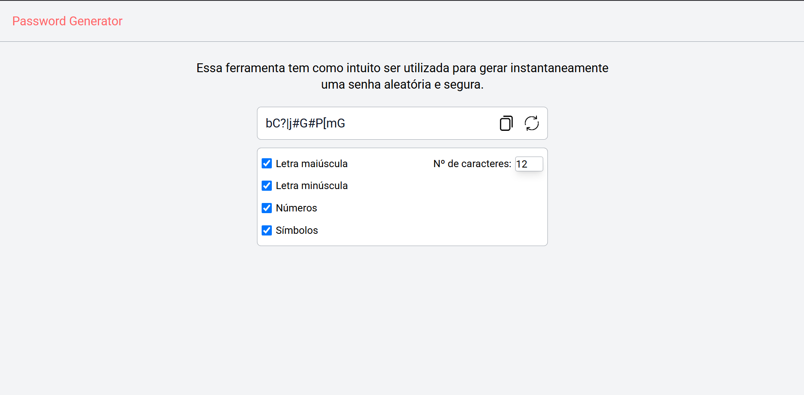

# Password Generator



## 📝 Descrição

> Gerador de senhas com React JS e Tailwind. Projeto para praticar minhas habilidades acerca do ReactJS e Tailwind CSS, no qual é possível o usuário gerar senhas de forma aleatória. 

## 🚀 Tecnologias Utilizadas

  ✅ HTML5
  ✅ CSS3
  ✅ JavaScript
  ✅ React

## 💻 Funcionalidades

  1. Gerar senha com letras maiúsculas
  2. Gerar senha com letras minúsculas
  3. Gerar senha com números
  4. Gerar senha com símbolos
  5. Escolher quantidade de caracteres da senha

## ☕ Como executar esse projeto

Para usar o projeto, siga estas etapas:

```

  1. Clonar esse repositório
  2. Instalar as dependências
  3. npm run dev

```

## 😄 Contribuidores

José Antonio

## 📝 Licença

Copyright (c) 2025 José Antonio
